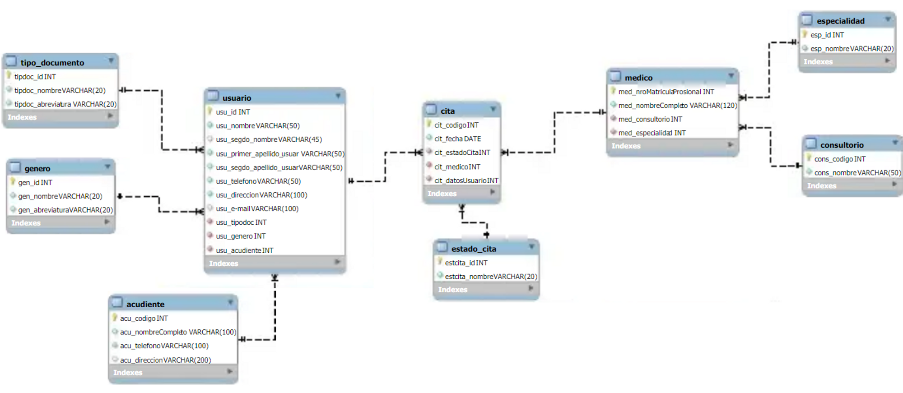

# D:G Campuslands-EPS (Microservicio CL EPS)

## Descripcion

CampusLands EPS requiere de la realización de un sistema de gestión de citas, donde se pueda crear, administrar, consultar y eliminar (con logs y registro) de las citas realizadas. Dicho esto, el sistema (BackEnd) debe permitir mediante unos EndPoints distribuir los procedimientos necesarios para su correcto funcionamiento, pues el equipo de Front-End requerirá de dichos EndPoints para plasmar a nivel de UI/UX las funcionalidades para su personal administrativo y pacientes. 

## Requerimientos técnicos

Para desarrollar dicho sistema de tipo BackEnd se deben tener los siguientes puntos en cuenta: 

- El sistema debe ser desarrollado con las herramientas MongoDB, NodeJS y ExpressJS. ***No estará permitido el uso de librerías ODM tales como Mongoose (Se asumirá como cancelada la prueba).***
- La conexión a la base de datos será mediante el SRV proveído de MongoDB Atlas, donde su conexión será guardada en variables de entorno (`dotenv`).
- Al no tener un ODM, el diagrama debe ser implementado en la base de datos con un mínimo de 10 documentos, exceptuando las colecciones de `genero`,`estado_cita` y `tipo_documento`, pues no cumple con dicha cantidad.
- El sistema (BackEnd) deberá ser subido en un repositorio de GitHub público, el cual contendrá un [Readme.md](http://Readme.md) que documente el propósito de dicho sistema y sus EndPoints realizados. Su desarrollo quedará a criterio propio del desarrollador.

## Diagrama E-R



## Instalacion

1. Clona el repositorio actual
```bash
git clone https://github.com/Zachlesk/Campuslands-EPS.git
```
2. Entra a la carpeta que contiene el repositorio y en la terminal, instala las dependecias e inicia el repositorio Node
```bash
npm install
```

3. Inicia el servidor backend

```bash
npm run zach
```

## Endpoints

1. Obtener todos los pacientes de manera alfabética.
```
    GET /pacientes/alfabetico
```
2. Obtener todas las citas de manera alfabética.

```
    GET /citas/:cit_fecha
```

3. Obtener todos los médicos de una especialidad en específico (por ejemplo, **‘Cardiología’**).

```
    GET /medicos/:med_especialidad
```

4. Encontrar la próxima cita para un paciente en específico (por ejemplo, el paciente con **user_id 1**).

```
    GET /proxima-cita/:cit_datosUsuario
```

5. Encontrar todos los pacientes que tienen citas con un médico en específico (por ejemplo, el médico con **med_numMatriculaProfesional 1**).

```
    GET /pacientes-por-medico/:cit_medico
```

6. Encontrar todas las citas de un día en específico (por ejemplo, **‘2023-07-12’**).
```
    GET /citas-por-fecha/:cit_fecha
```

7. Obtener todos los médicos con sus consultorios correspondientes.

```
    GET /medicos-con-consultorios
```

8. Contar el número de citas que un médico tiene en un día específico (por ejemplo, el médico con **med_numMatriculaProfesional 1 en ‘2023-07-12’**).

```
    GET /citas-por-medico-y-fecha/:cit_medico/:cit_fecha
```
